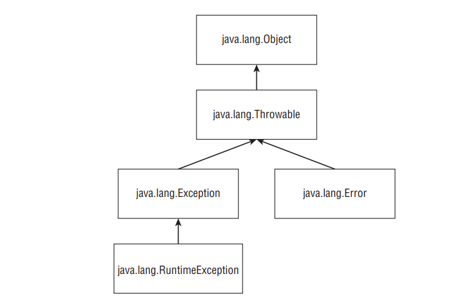

1. What is the Exception? 
	- There are two types of exceptions: 

a. Checked Exception:

-	Is a type of exception extends from Exception excepts RuntimeException.
-	Must handle by programmer in the code by try catch block or throws exception in the method declaration.

b. Unchecked Exception-	

-	Is a type of exception that extends from RuntimeException.

2. The ordered of Exception are very important.
```java
class Exception1 extends Exception { }
class Exception2 extends Exception { }
class Exception3 extends Exception { }
class SubClassException1 extends Exception1 { }


public class ExceptionOrder {
    public static void main(String... args) {
        try {
            boolean a = true;
            if (a) {
                throw new SubClassException1();
            } else {
                throw new Exception1();
            }
        } catch (SubClassException1 e) {
            System.out.println("SubClassException1");
        } catch (Exception1 e) {
            System.out.println("Exception1");
        } catch (Exception e) {
            System.out.println("Exception");
        } 
    }
}
```
The outputs is going to follow this:
```java
// SubClassException1
```
The order of exception must be arrange by from the special to supper class exception. If not, the compiler error about unreachable will occur.
3. If the catch block throw an exception run wheras still there is the finally block in the end of try catch block, the throw exception doen't run, it will run the finally block.
```java
class Exception1 extends Exception { }
class Exception2 extends Exception { }
class Exception3 extends Exception { }
class Exception4 extends Exception { }
class RuntimeException5 extends RuntimeException { }

public class ThrowExceptionFromCatchAndFinaly {
    public static void func() throws Exception2, Exception3 {
        try {
            if (true)
                throw new Exception1();
            else 
                throw new RuntimeException5();
        } catch (Exception1 e) {
            System.out.println(Exception1.class);
            throw new Exception2();
        } finally {
            System.out.println("Finally");
            throw new Exception3();
        }
    }
    public static void main(String... args) {
        try {
            func();
        } catch (Exception2 e) {
            System.out.println(Exception2.class);
        } catch (Exception3 e) {
            System.out.println(Exception3.class);
        } 
    }
}
```
The code will out put:
```java
// class Exception1
// Finally
// class Exception3
```
The code execute throw an exception in try block then run into catch Exception1 block, it printed out the line `System.out.println(Exception1.class);`, but after that, it ignore the `throw new Exception2();` and run finally block and catch the `throw new Exception3();` in the catch in main method.

4. Let's comment the `System.out.println(Exception1.class);` in the catch block in func() :
```java
class Exception1 extends Exception { }
class Exception2 extends Exception { }
class Exception3 extends Exception { }
class Exception4 extends Exception { }
class RuntimeException5 extends RuntimeException { }

public class ThrowExceptionFromCatchAndFinaly {
    public static void func() throws Exception2, Exception3 {
        try {
            if (true)
                throw new Exception1();
            else 
                throw new RuntimeException5();
        } catch (Exception1 e) {
            System.out.println(Exception1.class);
            throw new Exception2();
        } finally {
            System.out.println("Finally");
//             throw new Exception3();
        }
    }
    public static void main(String... args) {
        try {
            func();
        } catch (Exception2 e) {
            System.out.println(Exception2.class);
        } catch (Exception3 e) {
            System.out.println(Exception3.class);
        } 
    }
}
```
What outputs do you thinks?
```java
// class Exception1
// Finally
// class Exception2
```
The code run throw catch block and go to the finally block but the `throw new Exception2();` doesn't run right now until the finally block run out.