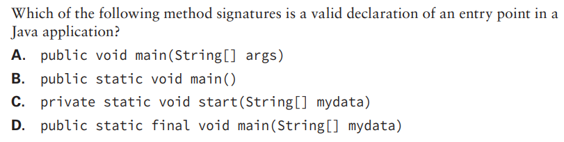
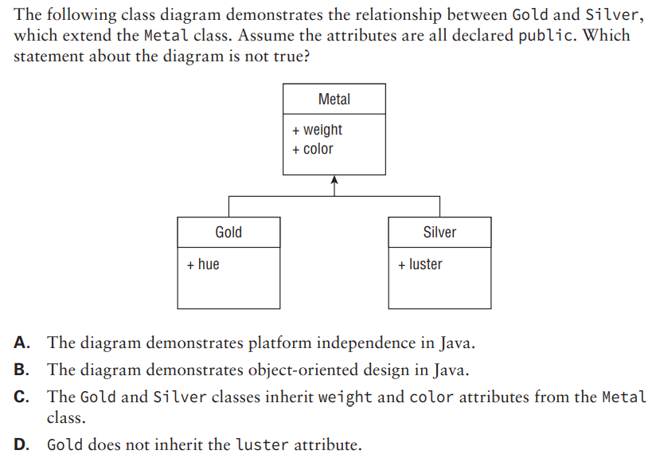
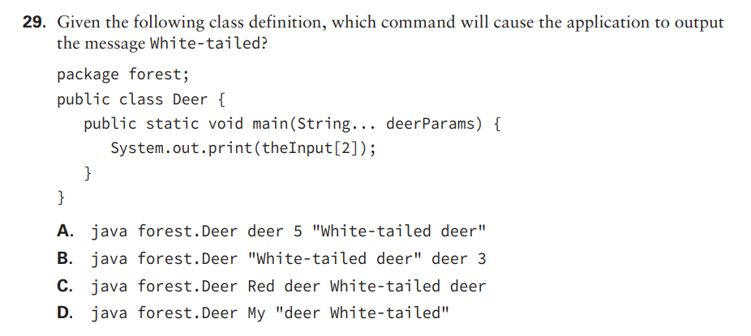

1. 
My answer: D
Correct answer: D

2. 
My answer: B
Correct answer: 

3. C
4. A, B
5. A
6. D
7. D
8. C
9. D
10. B
11. B, C
12. D
13. B
14. D
15. C
16. B
17. D
18. D
19. A
20. D
21. C
22. C
23. D
24. A
25. B
26. C
27. D
28. D
29. 
??
30. B
31. 